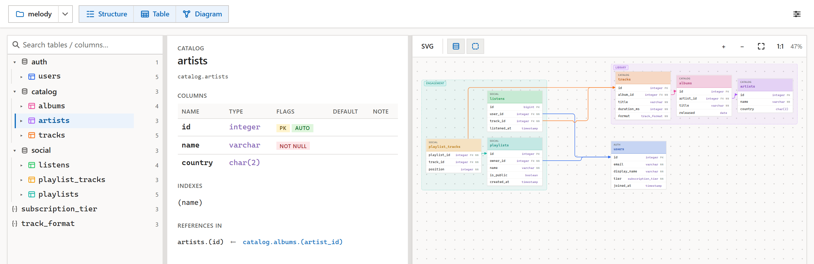

# dbml-view

Read-only viewer for [`.dbml`](https://dbml.dbdiagram.io/) files. Three panels — **Structure** (tree), **Detail** (selected table/enum), **Diagram** (ER). Runs as a browser SPA or as a Tauri desktop app with `.dbml` file-association on Windows.



Diagram rendering is meh, on par with all the other diagram software. But it lets you navigate the structure, which is what I was after, so there you go.

## Usage

- Web: <https://adawolfa.github.io/dbml-view/>
- Desktop (Windows): <https://github.com/adawolfa/dbml-view/releases>

## Develop

```sh
pnpm install
pnpm dev                             # web app
pnpm --filter @dbml-view/desktop dev # desktop shell
```

`pnpm build`, `pnpm typecheck`, `pnpm lint`, `pnpm test:e2e`.

## Layout

pnpm workspace, ESM, TypeScript strict.

- `packages/parser` — `@dbml/parse` wrapper + id/lookup helpers
- `packages/layout` — ELK-based table placement + custom orthogonal edge router
- `packages/components` — framework-free Custom Elements (`<dbml-structure>`, `<dbml-detail>`, `<dbml-diagram>`)
- `packages/i18n` — `en` / `cs`
- `apps/web` — Vite SPA shell
- `apps/desktop` — Tauri 2 shell (Windows)
- `samples/` — `.dbml` fixtures

## License

MIT — see [LICENSE](LICENSE).